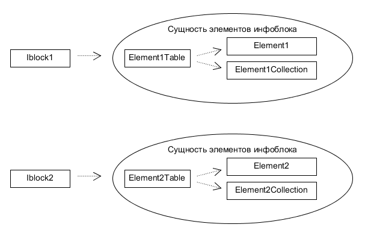
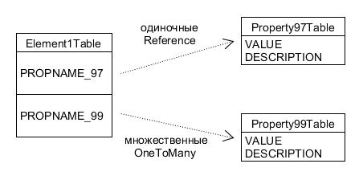

# Интеграция ORM

Перед чтением документации убедитесь, что вы ознакомлены с основным принципами Bitrix ORM и в частности с работой [объектов](70_objects.md) и [отношений](80_relations_new.md).

### Концепция и архитектура

Каждый инфоблок является самостоятельным типом данных со своим собственным набором свойств, в ORM он представляется отдельной сущностью:

Его свойства - это не просто скалярные значения, а отношения с отдельными мини-сущностями с двумя ключевыми полями: `VALUE` и `DESCRIPTION`. Единичные свойства представляются в элементе инфоблока полем `Reference`, множественные - `OneToMany`:

В сущности некоторых типов свойств могут быть добавлены дополнительные поля, например ссылка на привязанный элемент инфоблока:

Ориентироваться среди большого количества свойств поможет [механизм аннотаций](90_annotate.md). При индексации модуля `iblock` все инфоблоки будут описаны в виде сущностей ORM. Для получения подсказок в коде нужно будет явно обозначить класс инфоблока:

    // подключение модуля инфоблоков
    \Bitrix\Main\Loader::includeModule('iblock');

    // вводные данные
    $iblockId = 32;
    $iblockElementId = 678;

    // объект инфоблока
    $iblock = \Bitrix\Iblock\Iblock::wakeUp($iblockId);

    // объект элемента
    /** @var \Bitrix\Iblock\Elements\EO_Element32 $element */
    $element = $iblock->getEntityDataClass()::getByPrimary($iblockElementId)
        ->fetchObject();
    
    // получение свойства SOME_STRING
	$element->getSomeString();

Автолоадинг классов автоматически обработает вызов `getEntityDataClass()`, вам не придется предварительно компилировать сущность инфоблока.

Если вы хотите использовать подсказки IDE по типизации элемента инфоблока, необходимо явно задать его класс аннотацией вида

    /** @var \Bitrix\Iblock\Elements\EO_Element32 $element */
    
для элемента или 
 
    /** @var \Bitrix\Iblock\Elements\EO_Element32_Collection $element */

для коллекции, где число 32 в имени класса - ID инфоблока.  

### Чтение и запись 

Для получения значений свойств достаточно указать их имена в запросе:

    /** @var EO_Element32_Collection $elements */
    $elements = $iblock->getEntityDataClass()::getList([
        'select' => ['ID', 'SOME_FIELD', 'ANOTHER_FIELD.ELEMENT']
    ])->fetchCollection();

    foreach ($elements as $element)
    {
        echo $element->getSomeField()->getValue();
        echo $element->getAnotherField()->getElement()->getTitle();
    }

Поддерживаются стандартные механики отношений ORM.

Изменение значений и описаний свойств происходит непосредственно через объект свойства:

    /** @var \Bitrix\Iblock\Elements\EO_Element32 $element */
    
    // установка строкового значения
    $element->getSomeString()->setValue('new value');

    // установка описания
    $element->getSomeString()->setDescription('new descr');

    // установка привязки к элементу
    $element->getSomeElement()->setElement($anotherElement);

Кроме этого, можно поставить значение напрямую в поле свойства:

    $element->setSomeString('new value');

А также можно воспользоваться псведо объектом значения свойства `Bitrix\Iblock\ORM\PropertyValue`:

    use Bitrix\Iblock\ORM\PropertyValue;
    
    // только значение
    $value = new PropertyValue('new value');
    
    // значение и описание
    $value = new PropertyValue('new value', 'new descr');
    
    // установка значения/описания
    $element->setSomeString($value);  

Объект элемента сохраняется так же, как и любой другой объект ORM:

    $element->save();

Несмотря на то, что значения свойств фактически хранятся в разных таблицах в виде отношений с объектом, при сохранении внутри объекта все будет разложено по своим местам.

Удалить элемент можно через метод объекта `delete`:

    $element->delete();

При удалении так же, как и при сохранении, значения свойств будут обработаны автоматически. Удалятся и привязки к секциям.

### События

Для подписи на события сущности инфоблоков можно использовать штатные механизмы ORM:

    use Bitrix\Main\ORM\Data\DataManager;
    		
    // ID инфоблока
    $iblockId = 32;

    // объект инфоблока
    $iblock = \Bitrix\Iblock\Iblock::wakeUp($iblockId);
    
    // диспетчер событий
    $em = \Bitrix\Main\ORM\EventManager::getInstance();

    $em->registerEventHandler(
        $iblock->getEntityDataClass(),
        DataManager::EVENT_ON_BEFORE_ADD,
        'mymodule',
        'MyClass',
        'method'
    );

Поддержка действующих событий инфоблоков в данный момент **не реализована**.

### Обратная совместимость

В новом API в настоящий момент не реализована поддержка функциональных 

* фасетные индексы;
* x
* y
* z
* n
 (todo)

### Кастомные типы свойств

Чтобы добавить свои поля в сущность свойства, при описании свойства нужно задать отдельный коллбэк `GetORMFields`:

    public static function GetUserTypeDescription()
    {
        return [
            ...
            "GetORMFields" => array(__CLASS__, "GetORMFields"),
        ];
    }
    
    /**
     * @param \Bitrix\Main\ORM\Entity $valueEntity
     * @param \Bitrix\Iblock\Property $property
     */
    public static function GetORMFields($valueEntity, $property)
    {
        $valueEntity->addField(
            ...
        );
    }

### Базовые типы свойств

В обычном случае сущность свойства состоит из двух полей - VALUE (тип зависит от свойства) и, если определено настройками свойства, DESCRIPTION (StringField).

Строка: 
VALUE StringField 
DESCRIPTION StringField 
Нет дополнительных полей.

Число: 
VALUE IntegerField 
DESCRIPTION StringField  
Нет дополнительных полей.

Список: 
VALUE IntegerField 
DESCRIPTION StringField 
Дополнительные поля: 
ITEM Reference

Файл: 
VALUE IntegerField 
DESCRIPTION StringField 
Дополнительные поля: 
FILE Reference

Привязка к элементу: 
VALUE IntegerField 
DESCRIPTION StringField 
Дополнительные поля: 
ELEMENT Reference

Привязка к разделу: 
VALUE IntegerField 
DESCRIPTION StringField 
Дополнительные поля: 
SECTION Reference